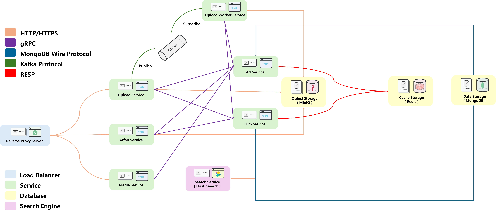

# Gimy Clone API
## Introduction
This is a backend to support a [stream-media website project](https://github.com/weiawesome/gimy_clone_website).

It divided into several service to handle with frontend request

1. Upload advertisement and film resource
2. Get the advertisement and film inserted with advertisement
3. Get the list of films by different filter
4. ...

## How To Start
### Deploy with docker-compose 
```shell
cd deployment/docker-compose
docker-compose up -d
```
#### Then service will deploy in http://127.0.0.1
## Skill Tree
| Subject                    |                      |                            |
|----------------------------|----------------------|----------------------------|
| Design Mode                | Layered Architecture | Micro Service Architecture |
| Transportation of Protocol | HTTP                 | gRPC                       |
| Event Driven               | Kafka                | Watermill                  |
| Storage                    | Mongodb              | MinIO                      |
| Search Engine              | Elasticsearch        |                            |
| Video Processing           | ffmpeg               |                            |
| Deployment                 | docker-compose       | kubernetes                 |

## System Architecture

## Project Architecture
### Micro Service Architecture
```
├── api_affair
│
├── api_media
│
├── api_upload
│
├── api_upload_worker
│
├── api_ad_service
│
├── api_film_service
│
├── assets
│
├── deployment
│
├── http_request_test
```
```
Note:
    Except deployment, http_request_test and assets, each directory represent with a service.

assets              ->    The directory to store the images.    
deployment          ->    The scirpts to deploy the applications.
http_request_test   ->    The http file to test the api.
    
api_affair          ->    The http server to handle with normal affair.
api_media           ->    The http server to get the media.
api_upload          ->    The http server to upload resource and create film.
api_upload_worker   ->    The http server to transform the media type and store it.

api_film_service    ->    The gRPC server to handle all data about film.
api_ad_service      ->    The gRPC server to handle all data about ad.
```
### Layered Architecture ( In Each Service )
```
├── api
│
├── service
│
├── repository
```
```
Note:
    In every service directory, most of them has api, service and repository.
    It totally represent the layered arichitecture presnetation, business and data-access layer.
    
In api directory
    1. Define all the interface for the service 
    2. Setting the model of request and response

In service directory
    1. Gain the data from representation layer
    2. Try to get data from data-access layer
    3. Finally it will do some calculate and return the value to representation layer 

In repository directory
    1. Gain the query from business layer
    2. Try to connect the database and make some CRUD operation then return the value  
```
## The Function For Each Service 
### [Service - Affair](./api_affair)
1. Get the films by different query
2. Get the advertisements by different query
### [Service - Media](./api_media)
1. Get the playlist in specific film's episode
2. Get the media including image, video and GIF.
### [Service - Upload](./api_upload)
1. Create a film and upload its information
2. Upload an advertisement
### [Service - Upload Worker](./api_upload_worker)
1. As a consumer get the mission from api-upload
2. Convert a file into HLS format and upload to database
### [Service - Ad](./api_ad_service)
1. Manipulate all the information about advertisement 
### [Service - Film](./api_film_service)
1. Manipulate all the information about film